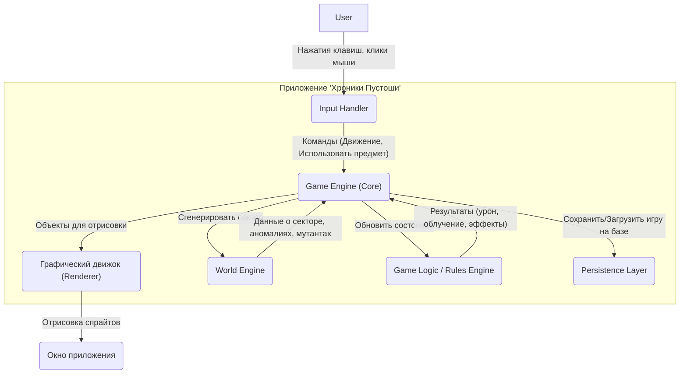

# 4. Композиция (Диаграмма компонентов)



### Описание компонентов

| Компонент | Описание |
| :--- | :--- |
| **Game Engine (Core)** | Оркестратор. Управляет основным игровым циклом. Связывает ввод пользователя с игровой логикой и состоянием мира. Инициирует отрисовку после каждого хода. |
| **Input Handler** | Преобразует события от клавиатуры и мыши в абстрактные игровые команды (`MoveCommand`, `UseItemCommand`). |
| **Графический движок (Renderer)** | Отвечает за всю визуализацию. Рисует тайлы карты, спрайты персонажа, мутантов, предметов, эффекты аномалий и элементы интерфейса (HUD) в окне приложения. |
| **World Engine** | Управляет миром Зоны. Генерирует и хранит данные о секторах, расположении аномалий, мутантов и предметов. |
| **Game Logic / Rules Engine** | Мозг игры. Здесь сосредоточена вся логика: расчет урона в бою, механика работы аномалий, эффекты артефактов, система радиации, простая логика поведения мутантов. |
| **Persistence Layer** | Отвечает за сохранение и загрузку состояния игры и конфигурационных файлов (монстры, предметы, артефакты). |
```
