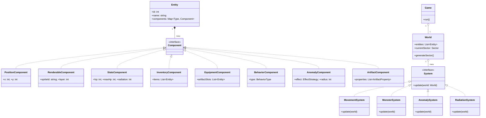

# 5. Логическая структура (Диаграмма классов)



### Описание ключевых классов и компонентов

| Класс/Компонент | Описание |
|:---|:---|
| **Entity** | Универсальный игровой объект (сталкер, мутант, предмет). Является контейнером для компонентов. |
| **Component** | Контейнер для данных, определяющий один аспект `Entity`. |
| **RenderableComponent** | Хранит `spriteId` (идентификатор спрайта для отрисовки, например `"player_idle.png"`) и `layer` (слой отрисовки, чтобы персонаж рисовался поверх пола). |
| **BehaviorComponent** | Определяет тип поведения сущности с помощью перечисления (enum), например: `AGGRESSIVE` (двигаться к игроку), `COWARDLY` (убегать от игрока). |
| **System** | Класс без состояния (stateless), который содержит всю игровую логику. Каждая система обрабатывает `Entity` с определенным набором компонентов. |
| **MonsterSystem** | Система, реализующая простую логику поведения для `Entity` c `BehaviorComponent`. Для типа `AGGRESSIVE` генерирует команду движения в сторону игрока, если тот в зоне видимости. |
```
