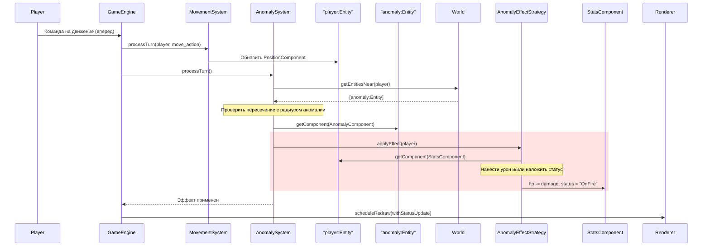
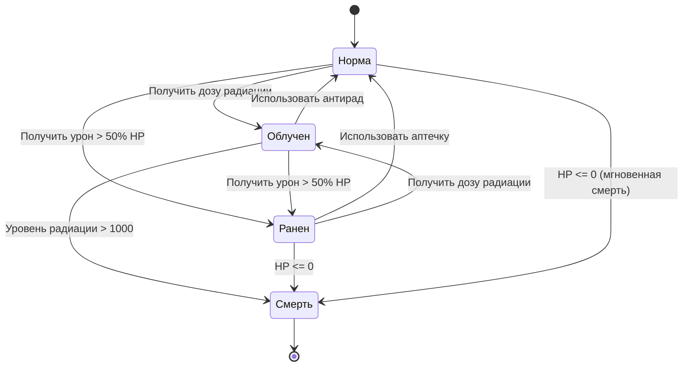

# 6. Взаимодействия и состояния

## 6.1. Диаграмма последовательности: Сталкер попадает в аномалию

```mermaid
sequenceDiagram
    participant Player
    participant GameEngine
    participant MovementSystem
    participant AnomalySystem
    participant PlayerEntity as "player:Entity"
    participant AnomalyEntity as "anomaly:Entity"

    Player->>GameEngine: Команда на движение (вперед)
    GameEngine->>MovementSystem: processTurn(player, move_action)
    MovementSystem->>PlayerEntity: Обновить PositionComponent
    
    GameEngine->>AnomalySystem: processTurn()
    AnomalySystem->>World: getEntitiesNear(player)
    World-->>AnomalySystem: [anomaly:Entity]

    Note over AnomalySystem: Проверить пересечение с радиусом аномалии
    AnomalySystem->>AnomalyEntity: getComponent(AnomalyComponent)
    rect rgba(255, 200, 200, .5)
      AnomalySystem->>AnomalyEffectStrategy: applyEffect(player)
      AnomalyEffectStrategy->>PlayerEntity: getComponent(StatsComponent)
      Note over AnomalyEffectStrategy: Нанести урон и/или наложить статус
      AnomalyEffectStrategy->>StatsComponent: hp -= damage, status = "OnFire"
    end

    AnomalySystem-->>GameEngine: Эффект применен
    GameEngine->>Renderer: scheduleRedraw(withStatusUpdate)

```

## 6.2. Диаграмма конечных автоматов: Состояния Сталкера

```mermaid
stateDiagram-v2
    [*] --> Норма

    Норма --> Облучен: Получить дозу радиации
    Облучен --> Норма: Использовать антирад

    Норма --> Ранен: Получить урон > 50% HP
    Ранен --> Норма: Использовать аптечку
    Ранен --> Облучен: Получить дозу радиации
    Облучен --> Ранен: Получить урон > 50% HP

    Облучен --> Смерть: Уровень радиации > 1000
    Ранен --> Смерть: HP <= 0
    Норма --> Смерть: HP <= 0 (мгновенная смерть)

    Смерть --> [*]
```