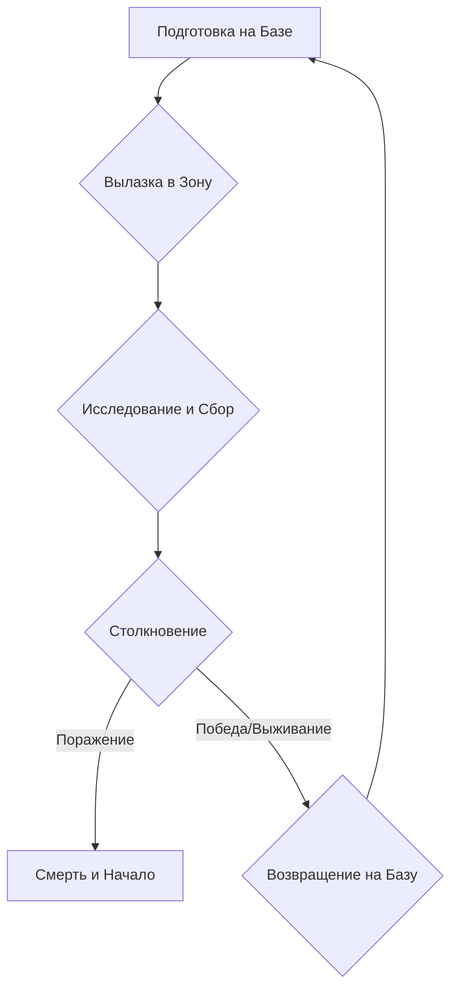

# Дизайн-документ: "Хроники Пустоши: Аномальный Эфир"

## 1. Обзор игры (Game Overview)

### 1.1. Название игры
Хроники Пустоши: Аномальный Эфир

### 1.2. Жанр
Пошаговый 2D Roguelike с элементами выживания и RPG.

### 1.3. Целевая аудитория
Игроки 18-35 лет, ценящие хардкорные и атмосферные игры. Поклонники таких проектов, как *S.T.A.L.K.E.R.*, *Fallout 1/2*, *Darkwood*, *Cataclysm: DDA*. Им важны глубокая игровая механика и вызов, а не передовая графика.

### 1.4. Игровая концепция
**"Вы — не герой, вы — выживший."** Игрок в роли сталкера отправляется в смертельно опасную, процедурно генерируемую Зону, чтобы разбогатеть на поиске таинственных артефактов. Каждый шаг может стать последним. Каждая вылазка — это уникальная история проб и ошибок, где правильная подготовка и знание мира важнее рефлексов.

### 1.5. Ключевые особенности
*   **Атмосфера безысходности:** Мрачный мир, полный опасностей, где игрок постоянно чувствует себя уязвимым.
*   **Высокий риск и высокая награда:** Самые ценные артефакты спрятаны в самых смертоносных аномалиях.
*   **Синергия артефактов:** Игроки могут создавать уникальные "билды" персонажа, комбинируя артефакты, которые дают как мощные бонусы, так и значительные штрафы.
*   **Тактическая глубина:** Позиционирование, использование укрытий и правильное управление ограниченными ресурсами — ключ к выживанию.
*   **Бесконечная реиграбельность:** Процедурная генерация мира, врагов и лута обеспечивает уникальность каждой игровой сессии.

### 1.6. Сравнение с аналогами

| Аналог | Сходства | Ключевые отличия |
| :--- | :--- | :--- |
| **S.T.A.L.K.E.R.** | Сеттинг, атмосфера, аномалии, артефакты, общая стилистика. | **Пошаговый геймплей.** Наша игра — это roguelike, а не FPS. Упор сделан на тактику и планирование, а не на рефлексы. |
| **Cataclysm: DDA** | Жанр (roguelike), процедурная генерация, глубокая система выживания. | **Низкий порог вхождения.** У нас более сфокусированный игровой процесс (поиск артефактов, а не симулятор выживания) и полноценный 2D-интерфейс вместо ASCII. |
| **Darkest Dungeon** | Мрачная атмосфера, идея негативных эффектов (стресс/радиация), B2P модель. | **Свобода исследования.** Мир нашей игры — это открытые локации-сетки, а не линейные коридоры. Игрок управляет одним персонажем, а не отрядом. |

### 1.7. Сеттинг и атмосфера
Постапокалиптический мир, вдохновленный эстетикой советской индустриализации и Чернобыльской зоной отчуждения. Заброшенные заводы, ржавеющий транспорт, мертвые леса и гниющие болота. Палитра — приглушенная, преобладают серые, коричневые и болотные тона. Мир живет своей жизнью: ветер качает деревья, где-то вдалеке воют мутанты, счетчик Гейгера тревожно щелкает.

## 2. Игровой процесс (Gameplay Mechanics)

### 2.1. Основной игровой цикл (Core Gameplay Loop)

1.  **Подготовка на Базе:** Игрок покупает снаряжение, получает квесты, лечится и сохраняет игру.
2.  **Вылазка в Зону:** Игрок выходит в процедурно сгенерированные сектора.
3.  **Исследование и Сбор:** Игрок изучает карту, ищет лут и артефакты.
4.  **Столкновение:** Игрок встречает мутантов или аномалии. Исход зависит от его подготовки и тактических решений.
5.  **Смерть или Возвращение:** В случае смерти игра начинается заново. В случае успеха игрок возвращается на базу с добычей, чтобы начать цикл снова, но уже более сильным и опытным.

### 2.2. Управление
*   **Перемещение:** `WASD` или стрелки.
*   **Взаимодействие/Подбор:** `E` или `Space`.
*   **Открыть инвентарь:** `I`.
*   **Перезарядка:** `R`.
*   **Действия в бою:** Выбор через UI с помощью мыши или цифровых клавиш (`1`, `2`, `3`...).

### 2.3. Боевая система
*   **Пошаговая:** Когда игрок совершает действие, все остальные сущности на карте также совершают свой ход.
*   **Очки действия (ОД):** У игрока есть ограниченное количество ОД за ход. Перемещение тратит 1 ОД, выстрел — 2 ОД, использование аптечки — 2 ОД. Это заставляет планировать действия.
*   **Позиционирование:** Укрытия (деревья, стены) снижают шанс попадания по игроку. Атака со спины или с фланга наносит повышенный урон.
*   **Ограниченные ресурсы:** Оружие имеет ограниченный боезапас и требует перезарядки, которая тратит ОД.

### 2.4. Система выживания
*   **Здоровье (HP):** Стандартный показатель жизни. При падении до нуля наступает смерть. Восстанавливается аптечками и отдыхом на базе.
*   **Радиация:** Накапливается в радиоактивных зонах и от некоторых артефактов. При высоком уровне начинает постепенно отнимать здоровье. Снижается специальными препаратами ("Антирад").

### 2.5. Система аномалий и артефактов
*   **Аномалии:** Видимые (иногда слабо) опасные зоны на карте. При попадании в них игрок получает урон или негативные эффекты.
*   **Артефакты:** Ценные предметы, которые можно найти внутри аномалий с помощью детектора. Артефакты помещаются в специальные слоты в инвентаре ("контейнеры") и дают пассивные бонусы.
*   **Принцип "двойного лезвия":** Почти каждый артефакт имеет как положительные, так и отрицательные свойства. *Пример: Артефакт "Кристалл" дает +20% к урону, но излучает радиацию (+2 рад/ход).*

### 2.6. Прогрессия персонажа
Прогрессия в игре основана не на уровнях и опыте, а на **снаряжении**. Найдя или купив лучшую броню, более мощное оружие и собрав эффективную комбинацию артефактов, игрок становится сильнее и может исследовать более опасные регионы.

## 3. Мир и история

### 3.1. История мира
После второй, менее известной катастрофы на ЧАЭС в начале 2000-х, вокруг станции образовалась аномальная Зона, изменяющая законы физики. Правительственные войска оцепили периметр, но это не остановило отчаянных смельчаков — сталкеров, которые начали проникать в Зону в поисках порожденных ею артефактов.

### 3.2. NPC на базе
База — единственный безопасный островок в мире. Здесь находятся ключевые NPC:
*   **Сидорович (Торговец):** Ворчливый, но честный торговец. Скупает хабар и продает снаряжение, патроны и медикаменты.
*   **Борода (Бармен, Квест-гивер):** Владелец местного бара. Источник слухов и заданий. Выдает квесты на поиск артефактов или зачистку логов мутантов.
*   **Доктор:** Лечит игрока за деньги.

### 3.3. Враги (Бестиарий)
*   **Слепой пес:** Быстрый, но слабый мутант. Атакует в стаях. Движется прямо на игрока.
*   **Кабан-мутант:** Медленный, но очень живучий. Может совершить "рывок" по прямой, сбивая с ног.
*   **Снорк:** Бывший военный в противогазе. Очень быстрый и совершает длинные прыжки к цели.

## 4. Игровые сущности (Ассеты)

### 4.1. Предметы
*   **Расходники:** Аптечка, Антирад, Бинт (останавливает кровотечение), Энергетик (временно увеличивает ОД).
*   **Оружие:** ПМм, АКМ-74/2У, Дробовик "Обрез", СВД.
*   **Броня:** Куртка новичка, Бронежилет, Комбинезон "СЕВА".

### 4.2. Артефакты (Примеры)

| Название | Положительный эффект | Отрицательный эффект |
|:---|:---|:---|
| **Медуза** | -10% получаемого урона | +5% к накоплению радиации |
| **Вспышка** | +2 Очка Действия за ход | -15% максимального здоровья |
| **Душа** | +1 HP регенерации в ход | -10% защиты от пуль |
| **Грави** | +20 кг к переносимому весу | -20% защиты от аномалий |

### 4.3. Аномалии (Примеры)
*   **Жарка:** Область раскаленного воздуха. Наносит периодический огненный урон. Визуально: легкое искажение воздуха, летящие искры.
*   **Воронка:** Гравитационная аномалия. Притягивает к центру и наносит сокрушительный урон. Визуально: кружащиеся листья и пыль.
*   **Электра:** Область, где бьют разряды статического электричества. Наносит электрический урон. Визуально: синие и белые разряды, потрескивание.

## 5. Интерфейс и Графика

### 5.1. Художественный стиль
Мрачный, детализированный 2D пиксель-арт или тайловая графика с высоким разрешением. Цветовая палитра угнетающая. Источники вдохновения: *Darkest Dungeon* (для UI), *Cataclysm: DDA* (для детализации мира), *S.T.A.L.K.E.R.* (для общей эстетики).

### 5.2. Пользовательский интерфейс (HUD)
Интерфейс должен быть минималистичным и не перегружать экран.
*   **Верхний левый угол:** Полоса здоровья (HP), полоса радиации.
*   **Нижний левый угол:** Мини-карта текущего сектора.
*   **Нижний центр:** Панель быстрого доступа к предметам.
*   **Нижний правый угол:** Информация об оружии (патроны в магазине / общий запас).
*   **Правая часть экрана:** Лог событий ("Вы получили 5 урона", "Слепой пес убит").

### 5.3. Звук и музыка
*   **Музыка:** Мрачный, медленный эмбиент. На базе может играть тихая гитарная мелодия.
*   **Звуки окружения:** Вой ветра, карканье ворон, далекий рык мутантов, треск аномалий.
*   **Звуки интерфейса:** Щелчок счетчика Гейгера, звук подбора предмета, клики в инвентаре.

## 6. Техническая реализация

### 6.1. Платформы и монетизация
*   **Платформы:** ПК (Windows, macOS, Linux).
*   **Модель распространения:** **Premium (Buy-to-Play).** Игра продается за единовременную плату. Никаких микротранзакций, лутбоксов или внутриигровой рекламы. Данный подход соответствует ожиданиям целевой аудитории и уважает время игрока.

### 6.2. Стек технологий
*   **Язык программирования:** **Python 3.** Идеален для быстрой разработки и прототипирования. Обладает огромным количеством библиотек и отлично подходит для инди-проектов.
*   **Основная библиотека:** **Pygame.** Простая и мощная библиотека для создания 2D-игр. Предоставляет все необходимые инструменты для рендеринга графики, обработки ввода, воспроизведения звука.
*   **Структура данных и конфигурации:** **JSON.** Все игровые сущности (предметы, мутанты, артефакты) будут описаны в легко читаемых `.json` файлах. Это позволяет быстро изменять баланс и добавлять контент без перекомпиляции игры.
*   **Сохранение игры:** **JSON.** Сохранение состояния игры в `.json` файл делает его понятным для отладки и потенциально редактируемым для опытных игроков.
*   **Звуковая подсистема:** **Pygame.mixer.** Встроенный модуль для работы со звуком, которого будет достаточно для воспроизведения фоновой музыки и звуковых эффектов.